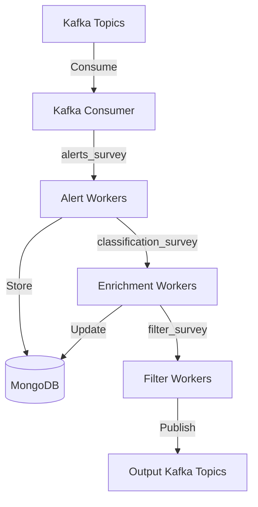

BOOM processes astronomical alerts through a four-stage pipeline. Each stage is decoupled via Redis/Valkey queues, enabling independent scaling and fault isolation.

## Pipeline overview

The alert pipeline consists of four stages:



## Stage 1: Kafka consumption

### Consumer implementation

Kafka consumers (`src/bin/kafka_consumer.rs`) read alerts from survey-specific topics and transfer them to Redis queues.

```bash
cargo run --release --bin kafka_consumer ztf 20240617 --programids public
```

<Note>
  The consumer can run multiple processes in parallel using the `--processes` flag for higher throughput.
</Note>

### Configuration

Each survey has its own consumer configuration in `config.yaml`:

```yaml
kafka:
  consumer:
    ztf:
      server: "localhost:9092"
      group_id: "" # Set via environment variable
    lsst:
      server: "usdf-alert-stream-dev.lsst.cloud:9094"
      schema_registry: "https://usdf-alert-schemas-dev.slac.stanford.edu"
      schema_github_fallback_url: "https://github.com/lsst/alert_packet/tree/main/python/lsst/alert/packet/schema"
      group_id: ""
      username: ""
      password: ""
```

### Queue management

Consumers push alerts to Redis lists with configurable limits:

```bash
# Limit to 15000 alerts in memory
kafka_consumer ztf 20240617 --max-in-queue 15000

# Clear the queue before consuming
kafka_consumer ztf 20240617 --clear
```

<Warning>
  Setting `--max-in-queue` too low may cause the consumer to block. Monitor queue depth to tune this parameter.
</Warning>

## Stage 2: Alert ingestion

### Alert worker responsibilities

Alert workers (`src/alert/base.rs:852-969`) handle:

1. **Deserialization**: Parse Avro bytes into Rust structs
2. **Crossmatching**: Query astronomical catalogs for nearby objects
3. **Formatting**: Convert to BSON documents
4. **Storage**: Insert into MongoDB collections
5. **Queueing**: Push candidate IDs to enrichment queue

### Deserialization process

For surveys using schema registries (LSST):

```rust
// Extract schema ID from magic byte header
let schema_id = u32::from_be_bytes([avro_bytes[1], avro_bytes[2], avro_bytes[3], avro_bytes[4]]);

// Fetch schema from registry (with caching)
let schema = self.get_schema("alert-packet", schema_id).await?;

// Deserialize alert
let value = from_avro_datum(&schema, &mut slice, None)?;
let alert: T = from_value::<T>(&value)?;
```

For surveys with embedded schemas (ZTF):

```rust
// Extract schema from Avro container file
let (schema, start_idx) = get_schema_and_startidx(avro_bytes)?;

// Deserialize with caching to avoid repeated schema extraction
let value = from_avro_datum(schema_ref, &mut &avro_bytes[start_idx..], None)?;
let alert: T = from_value::<T>(&value)?;
```

### Catalog crossmatching

Alert workers crossmatch alerts with astronomical catalogs using spatial queries. Configuration example:

```yaml
crossmatch:
  ztf:
    - catalog: PS1_DR1
      radius: 2.0 # arcseconds
      use_distance: false
      projection:
        _id: 1
        gMeanPSFMag: 1
        rMeanPSFMag: 1
        ra: 1
        dec: 1
    - catalog: Gaia_DR3
      radius: 2.0
      use_distance: false
      projection:
        _id: 1
        parallax: 1
        phot_g_mean_mag: 1
        ra: 1
        dec: 1
    - catalog: NED
      radius: 300.0 # arcseconds
      use_distance: true
      distance_key: "z"
      distance_max: 30.0
      distance_max_near: 300.0
      projection:
        _id: 1
        objtype: 1
        z: 1
        DistMpc: 1
```

Crossmatching uses MongoDB's geospatial queries:

```rust
let matches = collection
    .find_one(doc! {
        "coordinates.radec_geojson": {
            "$nearSphere": [ra - 180.0, dec],
            "$maxDistance": radius_rad,
        },
    })
    .projection(doc! {
        "_id": 1
    })
    .await?;
```

<Info>
  Crossmatch radius and fields can be customized per catalog. Use projections to limit returned fields and improve performance.
</Info>

### Storage and deduplication

Alerts are stored with automatic deduplication:

```rust
let status = collection
    .insert_one(alert)
    .await
    .map(|_| ProcessAlertStatus::Added(candid))
    .or_else(|error| match *error.kind {
        // Handle duplicate key error (code 11000)
        mongodb::error::ErrorKind::Write(
            mongodb::error::WriteFailure::WriteError(write_error)
        ) if write_error.code == 11000 => {
            Ok(ProcessAlertStatus::Exists(candid))
        }
        _ => Err(error),
    })?;
```

<Note>
  Duplicate alerts are detected via MongoDB unique indexes on the `_id` field (candid) and gracefully skipped.
</Note>

### Queue delays

Alert workers implement intelligent delays to prevent busy-waiting:

```rust
const QUEUE_EMPTY_DELAY_MS: u64 = 500;
const VALKEY_ERROR_DELAY_SECS: u64 = 5;
```

- **Empty queue**: Wait 500ms before checking again
- **Redis error**: Wait 5 seconds before retry (prevents log spam)

## Stage 3: Enrichment

### Enrichment worker responsibilities

Enrichment workers (`src/enrichment/base.rs:192-282`) handle:

1. **Batch processing**: Fetch up to 1000 alerts at once from Redis
2. **Alert retrieval**: Query MongoDB with aggregation pipelines
3. **Classification**: Run machine learning models on alert features
4. **Result storage**: Update MongoDB with classification scores
5. **Filter queueing**: Push alert object IDs to filter queue

### Batch processing

Enrichment workers process alerts in batches for efficiency:

```rust
// Pop up to 1000 candids from the queue
let candids: Vec<i64> = con
    .rpop::<&str, Vec<i64>>(&input_queue, NonZero::new(1000))
    .await?;

if candids.is_empty() {
    tokio::time::sleep(std::time::Duration::from_millis(500)).await;
    continue;
}
```

<Info>
  Batch sizes are optimized for throughput. Larger batches reduce overhead but increase latency.
</Info>

### Alert retrieval with aggregation

Enrichment workers use MongoDB aggregation pipelines to fetch and transform alerts:

```rust
pub async fn fetch_alerts<T: for<'a> serde::Deserialize<'a>>(
    candids: &[i64],
    alert_pipeline: &Vec<Document>,
    alert_collection: &mongodb::Collection<Document>,
) -> Result<Vec<T>, EnrichmentWorkerError> {
    let mut alert_pipeline = alert_pipeline.clone();
    
    // Inject $match stage with candids
    if let Some(first_stage) = alert_pipeline.first_mut() {
        *first_stage = doc! {
            "$match": {
                "_id": {"$in": candids}
            }
        };
    }
    
    let mut alert_cursor = alert_collection.aggregate(alert_pipeline).await?;
    // ... collect results
}
```

### Cutout retrieval

Image cutouts are stored separately and fetched when needed:

```rust
pub async fn fetch_alert_cutouts(
    candids: &[i64],
    alert_cutout_collection: &mongodb::Collection<Document>,
) -> Result<std::collections::HashMap<i64, AlertCutout>, EnrichmentWorkerError> {
    let filter = doc! {
        "_id": {"$in": candids}
    };
    let mut cursor = alert_cutout_collection.find(filter).await?;
    
    let mut cutouts_map = std::collections::HashMap::new();
    while let Some(result) = cursor.next().await {
        let document = result?;
        let candid = document.get_i64("_id")?;
        let alert_cutout = AlertCutout {
            candid,
            cutout_science: document.get_binary_generic("cutoutScience")?.to_vec(),
            cutout_template: document.get_binary_generic("cutoutTemplate")?.to_vec(),
            cutout_difference: document.get_binary_generic("cutoutDifference")?.to_vec(),
        };
        cutouts_map.insert(candid, alert_cutout);
    }
    Ok(cutouts_map)
}
```

### Classification models

BOOM supports multiple machine learning classifiers:

- **ACAI**: Deep learning classifier for ZTF alerts
- **BTSBot**: Binary classifier for fast transients
- Custom models can be added via the enrichment worker trait

<Note>
  Model implementations are in `src/enrichment/models/`. Each model handles feature extraction and inference.
</Note>

## Stage 4: Filtering

### Filter worker responsibilities

Filter workers (`src/filter/base.rs:850-969`) handle:

1. **Batch processing**: Fetch up to 1000 alert identifiers from Redis
2. **Filter execution**: Run user-defined MongoDB pipelines
3. **Result formatting**: Package alerts with filter metadata
4. **Kafka publishing**: Send matching alerts to output topics

### Filter structure

Filters are MongoDB aggregation pipelines stored in the database:

```rust
pub struct Filter {
    pub id: String,
    pub name: String,
    pub description: Option<String>,
    pub permissions: HashMap<Survey, Vec<i32>>,
    pub user_id: String,
    pub survey: Survey,
    pub active: bool,
    pub active_fid: String,
    pub fv: Vec<FilterVersion>,
    pub created_at: f64,
    pub updated_at: f64,
}
```

### Filter validation

Filters must pass validation to ensure they don't break the pipeline:

```rust
pub fn validate_filter_pipeline(filter_pipeline: &[serde_json::Value]) -> Result<(), FilterError> {
    // Must have at least one $match stage
    // Cannot use $group, $unwind, or $lookup
    // Cannot exclude _id or objectId fields
    // Last stage must project objectId
    // ...
}
```

<Warning>
  Invalid filters are rejected at upload time. Filters cannot modify the `_id` or `objectId` fields, which are required for downstream processing.
</Warning>

### Filter execution

Filters run as MongoDB aggregations with injected candids:

```rust
pub async fn run_filter(
    candids: &[i64],
    _filter_id: &str,
    mut pipeline: Vec<Document>,
    alert_collection: &mongodb::Collection<Document>,
) -> Result<Vec<Document>, FilterError> {
    // Insert candids into first $match stage
    pipeline[0].get_document_mut("$match")?.insert(
        "_id",
        doc! {
            "$in": candids
        },
    );
    
    // Execute pipeline
    let mut result = alert_collection.aggregate(pipeline).await?;
    // ... collect matching documents
}
```

### Output format

Matching alerts are packaged with filter metadata and published as Avro:

```rust
pub struct Alert {
    pub candid: i64,
    pub object_id: String,
    pub jd: f64,
    pub ra: f64,
    pub dec: f64,
    pub survey: Survey,
    pub filters: Vec<FilterResults>,
    pub classifications: Vec<Classification>,
    pub photometry: Vec<Photometry>,
    pub cutout_science: Vec<u8>,
    pub cutout_template: Vec<u8>,
    pub cutout_difference: Vec<u8>,
}

pub struct FilterResults {
    pub filter_id: String,
    pub filter_name: String,
    pub passed_at: f64, // timestamp in seconds
    pub annotations: String,
}
```

### Kafka publishing

Alerts are serialized to Avro and sent to Kafka:

```rust
pub async fn send_alert_to_kafka(
    alert: &Alert,
    schema: &Schema,
    producer: &FutureProducer,
    topic: &str,
) -> Result<(), FilterWorkerError> {
    let encoded = alert_to_avro_bytes(alert, schema)?;
    
    let record: FutureRecord<'_, (), Vec<u8>> = FutureRecord::to(&topic)
        .payload(&encoded);
    
    producer
        .send(record, std::time::Duration::from_secs(30))
        .await
        .map_err(|(e, _)| e)?;
    
    Ok(())
}
```

<Info>
  Kafka producer settings are optimized for throughput with configurable batching, retries, and timeouts.
</Info>

## Pipeline metrics

Each stage exposes Prometheus metrics:

### Alert workers
- `alert_worker.active`: Number of alerts currently being processed
- `alert_worker.alert.processed`: Total alerts processed, with status labels

### Enrichment workers
- `enrichment_worker.active`: Number of batches being processed
- `enrichment_worker.batch.processed`: Total batches processed
- `enrichment_worker.alert.processed`: Total alerts enriched

### Filter workers
- `filter_worker.active`: Number of batches being processed
- `filter_worker.batch.processed`: Total batches processed
- `filter_worker.alert.processed`: Total alerts filtered (included/excluded)

<Note>
  Metrics include `worker.id`, `status`, and `reason` labels for detailed monitoring.
</Note>

## Error handling

The pipeline implements robust error handling at each stage:

- **Retry logic**: Redis/Valkey errors trigger delays before retry
- **Skip on error**: Individual alert failures don't block the queue
- **Metrics tracking**: Errors are counted and labeled by reason
- **Graceful degradation**: Workers continue processing after recoverable errors

<Warning>
  Monitor error metrics to detect systemic issues. Sustained high error rates indicate configuration or infrastructure problems.
</Warning>
