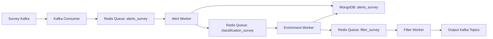

BOOM is designed to be modular, scalable, and performant. The system processes astronomical alerts through a multi-stage pipeline, with each stage handled by specialized worker pools.

## System components

BOOM's architecture consists of several key components:

<Steps>
  <Step title="Kafka consumers">
    Read alerts from astronomical survey Kafka topics and transfer them to Redis/Valkey in-memory queues for processing.
  </Step>
  
  <Step title="Alert workers">
    Format alerts into BSON documents, enrich them with catalog crossmatches, and store them in MongoDB.
  </Step>
  
  <Step title="Enrichment workers">
    Run machine learning classifiers on alerts and write classification results back to the database.
  </Step>
  
  <Step title="Filter workers">
    Execute user-defined MongoDB aggregation pipelines on alerts and publish matching alerts to output Kafka topics.
  </Step>
</Steps>

## Technology stack

### Why Redis/Valkey as a cache and task queue?

BOOM uses Redis/Valkey for in-memory queueing between pipeline stages:

- **Well maintained**: Strong community support and excellent documentation across multiple programming languages
- **Performance**: Fast in-memory operations that can handle high-throughput alert streams
- **Versatility**: Serves as cache, task queue, and message broker - reducing system complexity
- **Simplicity**: Unlike Celery, Dask, or RabbitMQ, Redis/Valkey avoids complexity, memory leaks, and maintenance overhead

The system is designed so Redis/Valkey can be swapped for another task queue with minimal code changes.

### Why MongoDB as the database?

MongoDB proved successful in Kowalski, another broker that inspired BOOM:

- **Multi-language support**: Excellent client libraries across programming languages
- **Schema flexibility**: No migrations needed when adding new astronomical catalogs for crossmatching
- **Rich query language**: Complex aggregation pipelines perfect for alert filtering
- **Performance**: Fast queries and indexing for high-volume data

<Note>
  Unlike PostgreSQL, MongoDB doesn't require enforcing a rigid schema or running migrations whenever new catalog fields are added.
</Note>

### Why Kafka as the message broker?

Kafka is the standard for astronomical alert distribution:

- **Industry standard**: Used by ZTF, LSST, and other major astronomical surveys
- **Scalability**: Handles massive data volumes with fault tolerance
- **Ecosystem**: Rich tooling and library support
- **Compatibility**: Downstream services expect Kafka topics

<Info>
  BOOM keeps the internal cache/task queue (Redis/Valkey) separate from the public-facing message broker (Kafka) for better modularity.
</Info>

## Avro schema handling

### Working with Avro and Rust

BOOM uses the `rsgen-avro` crate to generate Rust structs from Avro schemas:

<Steps>
  <Step title="Install rsgen-avro">
    ```bash
    cargo install rsgen-avro --features="build-cli"
    ```
  </Step>
  
  <Step title="Download schemas">
    Get the latest Avro schemas for your survey:
    - [ZTF schemas](https://github.com/ZwickyTransientFacility/ztf-avro-alert)
    - [LSST schemas](https://github.com/lsst/alert_packet)
  </Step>
  
  <Step title="Generate Rust structs">
    ```bash
    rsgen-avro "path/to/schemas/directory" -
    ```
    This outputs Rust structs to stdout, which you can copy into your source files.
  </Step>
</Steps>

<Note>
  ZTF Rust structs are already generated in `src/types.rs`. The `Alert` struct includes a custom `from_avro_bytes` method for deserialization.
</Note>

### Schema registry

For surveys like LSST that use schema registries, BOOM implements the `SchemaRegistry` struct (`src/alert/base.rs:242-543`) with:

- **Caching**: Stores fetched schemas to avoid repeated network requests
- **GitHub fallback**: Falls back to GitHub when the registry is unavailable
- **Version management**: Handles schema versioning and evolution

```rust
pub struct SchemaRegistry {
    survey: Survey,
    client: reqwest::Client,
    cache: HashMap<String, Schema>,
    url: String,
    github_fallback_url: Option<String>,
}
```

## BSON serialization

BOOM serializes Rust structs to BSON before writing to MongoDB:

<Accordion title="Why not use Rust structs directly?">
  While MongoDB's Rust driver can serialize/deserialize structs directly, Rust structs cannot dynamically remove null fields. This would result in many null fields in the database.
  
  Instead, BOOM:
  1. Serializes Rust structs to BSON documents
  2. Sanitizes documents (removes null fields)
  3. Writes clean documents to MongoDB
  
  When querying, both BSON documents or Rust structs can be returned depending on the use case.
</Accordion>

## Data flow

Here's how an alert flows through BOOM:



<Steps>
  <Step title="Ingestion">
    Kafka consumers read alerts from survey topics and push them to Redis queues.
  </Step>
  
  <Step title="Processing">
    Alert workers deserialize alerts, perform catalog crossmatches, and store them in MongoDB.
  </Step>
  
  <Step title="Enrichment">
    Enrichment workers retrieve alerts, run ML classifiers, and update classification results.
  </Step>
  
  <Step title="Filtering">
    Filter workers apply user-defined filters and publish matching alerts to Kafka.
  </Step>
</Steps>

## Scheduler architecture

The scheduler (`src/bin/scheduler.rs`) manages all worker pools:

```rust
let alert_pool = ThreadPool::new(
    WorkerType::Alert,
    n_alert as usize,
    args.survey.clone(),
    config_path.clone(),
);
let enrichment_pool = ThreadPool::new(
    WorkerType::Enrichment,
    n_enrichment as usize,
    args.survey.clone(),
    config_path.clone(),
);
let filter_pool = ThreadPool::new(
    WorkerType::Filter,
    n_filter as usize,
    args.survey,
    config_path,
);
```

The scheduler:
- Spawns worker pools for each stage
- Monitors worker health with heartbeat logs every 60 seconds
- Handles graceful shutdown on SIGINT (Ctrl+C)
- Initializes database indexes for the survey

<Warning>
  Currently, worker counts are static. Dynamic scaling based on system load is planned for future releases.
</Warning>

## Observability

BOOM includes comprehensive observability features:

### Metrics

Prometheus metrics are exposed on port 9090 for:
- Alert processing throughput
- Worker activity and batch sizes
- Error rates by stage
- Queue depths

See the [README](https://github.com/boom-astro/boom) for Prometheus query examples.

### Logging

Configurable logging via the `RUST_LOG` environment variable:

```bash
# Set to debug level, with ort crate limited to errors
RUST_LOG=debug,ort=error cargo run --bin scheduler -- ztf
```

Add span events for performance profiling:

```bash
BOOM_SPAN_EVENTS=new,close cargo run --bin scheduler -- ztf
```

<Info>
  The "close" span event is particularly useful as it includes execution time information.
</Info>
