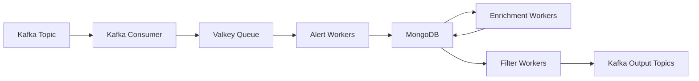

BOOM processes astronomical alerts through a multi-stage pipeline designed for modularity, scalability, and performance. This guide explains each stage of alert processing.

## Pipeline architecture

BOOM's pipeline consists of three worker types, each handling a specific task:



## Stage 1: Kafka consumer

The Kafka consumer is the entry point for alerts into the BOOM pipeline.

### What it does

1. Reads alerts from survey Kafka topics (ZTF, LSST, DECam)
2. Deserializes Avro-encoded alert packets
3. Transfers alerts to Valkey (Redis-compatible) in-memory queues
4. Manages backpressure with configurable queue limits

### Configuration

Kafka connection settings are defined in `config.yaml`:

```yaml config.yaml
kafka:
  consumer:
    ztf:
      server: "localhost:9092"
      group_id: "" # Set via BOOM_KAFKA__CONSUMER__ZTF__GROUP_ID
    lsst:
      server: "usdf-alert-stream-dev.lsst.cloud:9094"
      schema_registry: "https://usdf-alert-schemas-dev.slac.stanford.edu"
      group_id: "" # Set via environment variable
      username: "" # Set via environment variable
      password: "" # Set via environment variable
```

<Note>
The consumer uses a unique `instance_id` UUID to distinguish metrics from different instances.
</Note>

### Metrics

The consumer exports Prometheus metrics:

- `kafka_consumer_alert_processed_total`: Total alerts consumed
- Throughput: `irate(kafka_consumer_alert_processed_total[5m])`

## Stage 2: Alert ingestion workers

Alert workers read from Valkey queues and prepare alerts for database storage.

### Responsibilities

1. **Format conversion**: Convert alerts to BSON documents for MongoDB
2. **Crossmatching**: Query archival catalogs for sources near the alert position
3. **Database write**: Store formatted alerts in MongoDB collections
4. **Queue for enrichment**: Add alerts to enrichment processing queue

### Crossmatching catalogs

Crossmatches are configured per survey in `config.yaml`:

```yaml config.yaml
crossmatch:
  ztf:
    - catalog: PS1_DR1
      radius: 2.0 # arcseconds
      use_distance: false
      projection:
        _id: 1
        gMeanPSFMag: 1
        rMeanPSFMag: 1
        iMeanPSFMag: 1
    - catalog: Gaia_DR3
      radius: 2.0
      use_distance: false
      projection:
        parallax: 1
        phot_g_mean_mag: 1
    - catalog: NED
      radius: 300.0
      use_distance: true
      distance_key: "z"
      distance_max: 30.0
```

<Tip>
The `projection` field limits which catalog fields are returned, reducing memory usage and query time.
</Tip>

### Metrics

Alert workers track:

- `alert_worker_active`: Alerts currently being processed
- `alert_worker_alert_processed_total`: Total alerts processed
- Processing rate: `irate(alert_worker_alert_processed_total[5m])`

## Stage 3: Enrichment workers

Enrichment workers add scientific context by running classification models.

### Classification pipeline

<Steps>

<Step title="Fetch alert batch">
Enrichment workers read alerts from MongoDB in batches for efficiency.
</Step>

<Step title="Run classifiers">
Execute machine learning models to classify alerts by type:
- Supernovae
- Active galactic nuclei
- Variable stars
- Asteroids
- Artifacts
</Step>

<Step title="Update database">
Write classification scores back to the alert documents in MongoDB:

```json
{
  "_id": 2462315415115010042,
  "objectId": "ZTF24aabcdef",
  "classifications": [
    {
      "classifier": "supernova_cnn",
      "score": 0.87
    },
    {
      "classifier": "variable_star_rf",
      "score": 0.12
    }
  ]
}
```
</Step>

</Steps>

### Batch processing

Enrichment workers process multiple alerts simultaneously to:
- Amortize model loading overhead
- Maximize GPU utilization
- Improve throughput

### Metrics

Enrichment workers export:

- `enrichment_worker_active`: Alerts currently being enriched
- `enrichment_worker_batch_processed_total`: Total batches processed
- `enrichment_worker_alert_processed_total`: Total alerts enriched
- Batch size: `irate(enrichment_worker_alert_processed_total[5m]) / irate(enrichment_worker_batch_processed_total[5m])`

## Stage 4: Filter workers

Filter workers execute user-defined MongoDB aggregation pipelines to identify interesting alerts.

### How filters work

1. **Load filters**: Read active filter definitions from the `filters` MongoDB collection
2. **Build pipeline**: Construct MongoDB aggregation pipeline with:
   - Auxiliary data lookups (previous photometry, forced photometry)
   - User-defined filter stages
   - Permission checks (for ZTF data rights)
3. **Execute filters**: Run aggregation pipeline against alert collections
4. **Send results**: Publish matching alerts to Kafka output topics

### Filter structure

Each filter consists of:

```javascript
{
  "id": "uuid-here",
  "name": "Bright Supernovae",
  "active": true,
  "survey": "ZTF",
  "permissions": {
    "ZTF": [1, 2, 3]  // Program IDs this filter can access
  },
  "active_fid": "v2e0fs",
  "fv": [
    {
      "fid": "v2e0fs",
      "pipeline": "[{\"$match\":{...}}]",
      "created_at": 2459123.5,
      "changelog": "Initial version"
    }
  ]
}
```

<Note>
Filters are survey-specific. A filter created for ZTF won't run on LSST alerts.
</Note>

### Output format

Alerts that pass filters are serialized to Avro format and sent to Kafka:

```json
{
  "candid": 2462315415115010042,
  "objectId": "ZTF24aabcdef",
  "jd": 2459123.5,
  "ra": 123.456,
  "dec": 45.678,
  "survey": "ZTF",
  "filters": [
    {
      "filter_id": "uuid-here",
      "filter_name": "Bright Supernovae",
      "passed_at": 1703001234.5,
      "annotations": "{}"
    }
  ],
  "classifications": [...],
  "photometry": [...],
  "cutoutScience": "<base64>",
  "cutoutTemplate": "<base64>",
  "cutoutDifference": "<base64>"
}
```

### Metrics

Filter workers track:

- `filter_worker_active`: Alerts currently being filtered
- `filter_worker_batch_processed_total`: Total filter batches executed
- `filter_worker_alert_processed_total`: Total alerts that passed filters (labeled by `reason`: `passed` or `failed`)

## Worker scaling

The number of workers for each stage is configured in `config.yaml`:

```yaml config.yaml
workers:
  ztf:
    command_interval: 500  # milliseconds between worker commands
    alert:
      n_workers: 3
    enrichment:
      n_workers: 3
    filter:
      n_workers: 3
```

<Warning>
Dynamic scaling based on load is under development. Currently, worker counts are static.
</Warning>

## Database collections

BOOM uses MongoDB collections organized by survey:

### ZTF collections

- `ZTF_alerts`: Primary alert documents with candidate data
- `ZTF_alerts_aux`: Auxiliary data (previous candidates, forced photometry)
- `ZTF_alerts_cutouts`: Image cutouts (science, template, difference)

### LSST collections

- `LSST_alerts`: Primary alert documents
- `LSST_alerts_aux`: Auxiliary data including previous DIASources

### Shared collections

- `filters`: User-defined filter definitions
- Catalog collections: `PS1_DR1`, `Gaia_DR3`, `NED`, etc.

## Performance considerations

<AccordionGroup>
  <Accordion title="Batch size tuning">
    Enrichment and filter workers process alerts in batches. Larger batches improve throughput but increase latency. Adjust batch sizes based on your latency requirements.
  </Accordion>
  
  <Accordion title="MongoDB indexing">
    BOOM automatically creates indexes for:
    - Alert IDs (`_id`)
    - Object IDs (`objectId`)
    - Timestamps (`candidate.jd`)
    - Sky coordinates for spatial queries
    
    Additional indexes may improve query performance for specific filters.
  </Accordion>
  
  <Accordion title="Crossmatch optimization">
    Use the `projection` field to limit crossmatch results to only needed fields. Set appropriate `radius` values to avoid retrieving too many candidates.
  </Accordion>
  
  <Accordion title="Memory management">
    Valkey queue size (`--max-in-queue`) limits memory usage. If consumers are faster than workers, reduce this value to prevent memory exhaustion.
  </Accordion>
</AccordionGroup>

## Next steps

<CardGroup cols={2}>
  <Card title="Creating filters" icon="code" href="/guides/creating-filters">
    Write MongoDB aggregation pipelines to identify interesting alerts
  </Card>
  <Card title="Monitoring" icon="chart-line" href="/guides/monitoring">
    Track pipeline performance with Prometheus metrics
  </Card>
</CardGroup>
